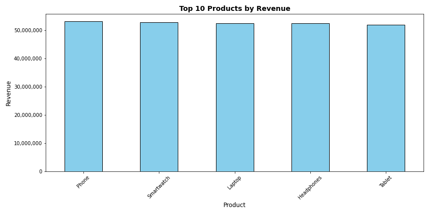
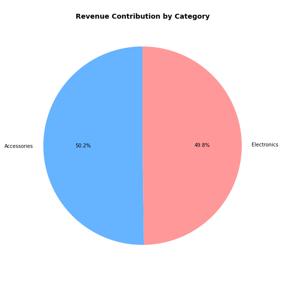

# Sales Analytics Project (Python)

## Overview
This project analyzes sales data to identify trends, top-performing products, and business insights.

## Key Steps
- Data Cleaning
- Feature Engineering (Revenue calculation)
- Exploratory Data Analysis
- Data Visualization

## Insights
- Top products contribute highest revenue
- Monthly revenue trends identified
- Region-wise performance analyzed
- Category contribution evaluated

## Visualizations

### 1. Top Products by Revenue

### 2. Monthly Sales Trend

### 3. Revenue by Region

### 4. Category Distribution

## Tools Used
- Python
- Pandas
- NumPy
- Matplotlib
- Seaborn
